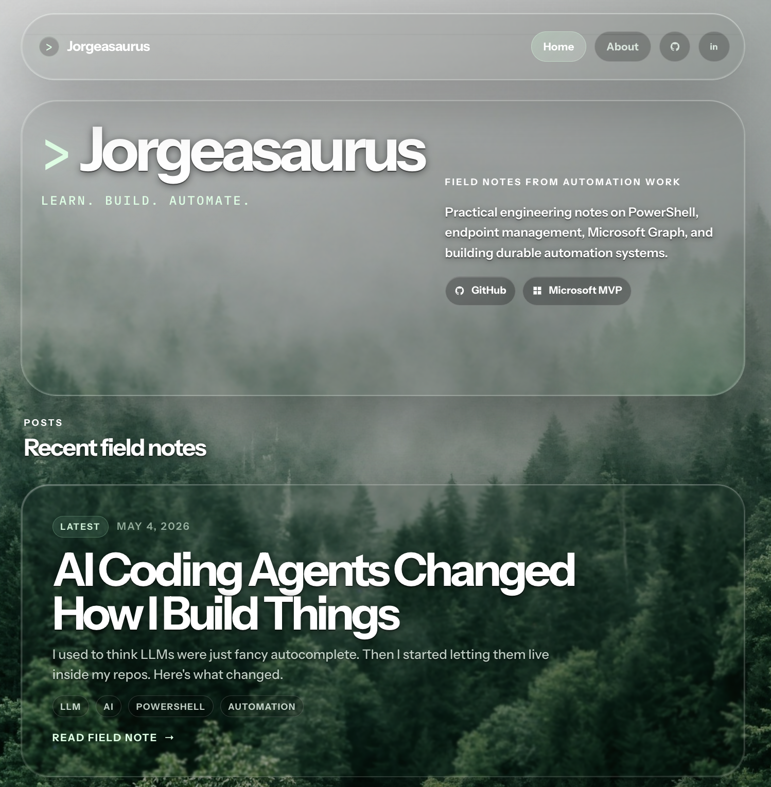

# Jorgeasaurus Blog

Personal field-notes site for PowerShell, endpoint management, Microsoft Graph, automation, and practical engineering notes.

Live site: [Jorgeasaur.us](https://Jorgeasaur.us)



## Stack

- React
- Vite
- TypeScript
- MDX
- React Router
- Vercel Analytics

## Local Development

Install dependencies:

```bash
npm install
```

Start the dev server:

```bash
npm run dev
```

Build for production:

```bash
npm run build
```

Preview the production build:

```bash
npm run preview
```

## Project Structure

- `src/content/` contains post metadata, MDX posts, and post image mappings.
- `src/pages/` contains the home, about, and post routes.
- `src/components/` contains shared UI components.
- `src/styles/` contains the global and app-level styling.
- `public/images/` contains site and post assets.

## Notes

The site is designed around a glass/terminal-inspired aesthetic with responsive mobile layouts, article hero media, adjacent-post navigation, and reduced-motion/reduced-transparency fallbacks.
